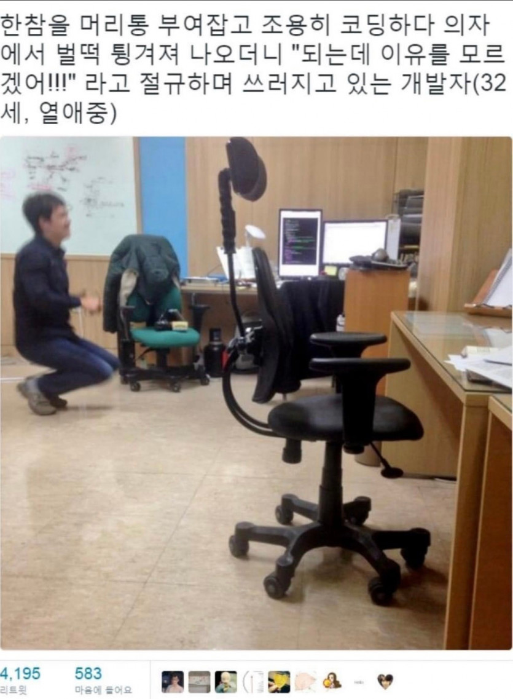
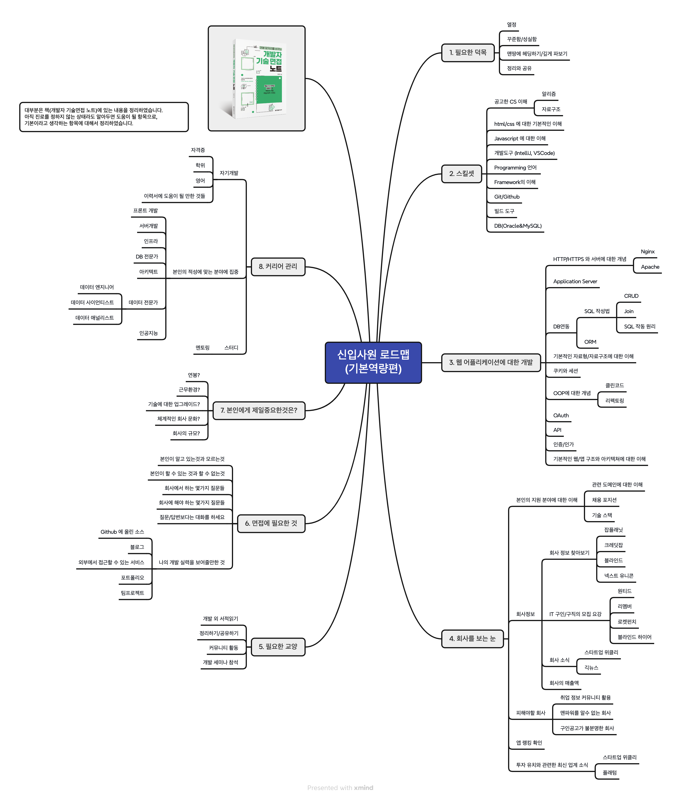

# tech-interview-for-junior
The technical interview knowledge that a junior backend developer should possess.

# Table of Contents

- [tech-interview-for-junior](#tech-interview-for-junior)
- [주니어 개발자 인터뷰 가이드(2024.04.20 한빛미디어 세미나)](#----------------20240420-----------)
    * [소개](#--)
        + [19년차 백엔드 개발자](#19----------)
        + [경력](#--)
        + [Git](#git)
        + [Contact](#contact)
- [책 소개](#----)
    * [취업/이직을 위한 준비](#------------)
    * [회사 찾기](#-----)
    * [코딩 테스트](#------)
- [회사가 선택하는 주니어 개발자의 기준](#--------------------)
    * [채용 공고를 분석해보자.](#------------)
        + [채용 기준](#-----)
        + [우대사항 - 기존 서비스를 스프링부트 기반 프레임워크로 전환해본 경험이 있는 분](#--------------------------------------------)
        + [내 동료를 내가 직접 뽑아야 한다고 상상해보자.](#-------------------------)
        + [내 이력서를 기반으로 모의 면접을 진행해보자.](#------------------------)
    * [역량이란 무엇일까?](#----------)
        + [주니어 개발자는 무엇을 갖추어야 할까?](#---------------------)
        + [주니어 개발자의 스킬셋 예시](#---------------)
        + [회사가 기대하는 주니어 개발자의 자질은?](#----------------------)
    * [경력직이라면?](#-------)
        + [신입과 경력 모두 주의깊게 봐야 할 채용 공고](#-------------------------)
        + [실제 평가표를 기준으로 고민해보자.](#------------------)
        + [💡 정리하자면](#--------)
    * [주니어 개발자를 위한 기술 로드맵](#------------------)
        + [기술 목록 첫번째 - 전반적인 백엔드 기술 로드맵](#---------------------------)
        + [기술 목록 두번째 - 자바 학습 로드맵](#---------------------)
        + [기술 목록 세번째 - 시니어가 되어 가는 길목에서 알아야 할 것들](#------------------------------------)
        + [기술 목록 네번째 - 시니어로써 설계 경험을 쌓을 무렵 알아둬야 할 데이터베이스 확장 처리 전략](#-----------------------------------------------------)
- [인기있는 질문들](#--------)
- [사전 질문 및 Q&A](#--------q-a)
- [끝맺음](#---)

<small><i><a href='http://ecotrust-canada.github.io/markdown-toc/'>Table of contents generated with markdown-toc</a></i></small>

# 주니어 개발자 인터뷰 가이드
2024.04.20 한빛미디어 세미나자료 입니다. 신입 및 주니어를 대상으로 하였고, 더 자세한 내용은 책([개발자 기술면접 노트](https://product.kyobobook.co.kr/detail/S000212738756) 를 참고하세요. 

## 소개

>
> Yes24 - https://www.yes24.com/Product/Goods/125554439
> 
> KyoboBooks - https://product.kyobobook.co.kr/detail/S000212738756
>

# 인프런 강의

- [시니어면접관이 알려주는 개발자 취업과 이직, 한방에 해결하기 이론편](https://www.inflearn.com/course/%EC%8B%9C%EB%8B%88%EC%96%B4-%EB%A9%B4%EC%A0%91%EA%B4%80-%EC%95%8C%EB%A0%A4%EC%A3%BC%EB%8A%94-%EC%B7%A8%EC%97%85-%EC%9D%B4%EC%A7%81-%EC%9D%B4%EB%A1%A0)
- [시니어면접관이 알려주는 개발자 취업과 이직, 한방에 해결하기 실전편](https://www.inflearn.com/course/%EC%8B%9C%EB%8B%88%EC%96%B4-%EB%A9%B4%EC%A0%91%EA%B4%80-%EC%95%8C%EB%A0%A4%EC%A3%BC%EB%8A%94-%EC%B7%A8%EC%97%85-%EC%9D%B4%EC%A7%81-%EC%8B%A4%EC%A0%84)

### 19년차 백엔드 개발자

- 카카오 비즈파트너플랫폼 개발 리드

### 경력

- KAKAO Corp (2018 ~ Now,  Leader)
- LG Fashion (2017 ~ 2018, Senior Manager)
- Coupang (2013 ~ 2017, Sr.Software Engineer, L5)
- Freelance Developer (2008 ~ 2013)
    - Samsung Electronics OSP 2.5, AA, Manager
    - SK Telecom T-Gate, AA/TL, Manager
    - GS Homeshopping E-Commerce Platform Developement, developer

### Git
- Personal : [https://github.com/gliderwiki/gliderwiki](https://github.com/gliderwiki/gliderwiki)
- for Book : [https://github.com/haru-note/tech-interview](https://github.com/haru-note/tech-interview)
- for Study : [https://github.com/villainscode](https://github.com/villainscode)

### Contact
- Instagram - [https://www.instagram.com/codevillains](https://www.instagram.com/codevillains)
- email - [villainscode@gmail.com](mailto:villainscode@gmail.com)

# 책 소개

> **책을 집필한 이유**
>
- 직접 채용을 해야 하는 환경에서 서류 검토와 기술 면접에 참여해보니 준비가 미흡한 지원자들이 꽤 많이 존재함.
- 상위권 대학을 졸업하고 꽤 큰 기업에서 일을 했으나 본인을 잘 포장하지 못하는 지원자 혹은 기술적 성장의 진로를 잡지 못해 고민인 지원자들을 보며 “왜?” 를 고민하기 시작
- 어떤 부분에서 취업/이직에 대한 경쟁력을 갖추기 위한 가이드를 해줘야 할까?를 고민
- 내가 가지고 있는 자료로 충분히 도움을 줄 수 있을거 같다고 결론을 얻고 책을 쓰기 시작
    - 초기에는 책 보다는 오픈소스처럼 온라인 퍼블리싱을 기획하여 자료를 취합하기 시작
- 최대한 실행 가능하고, 현실적으로 접근하기 쉬운 방법을 제시하려고 노력함

## 취업/이직을 위한 준비

> **취업/이직을 위해서 어떤 부분을 준비해야 할까?**
>

- **서류 작성**
    - 오프라인 제출용 서류는 항상 가지고 있어야 한다.
    - 온라인은 링크드인을 기준으로 두세곳 등록해 놓는다.
    - 필수 개인정보를 제외한 나머지는 공간 낭비/시간 낭비
    - 지원 분야 명시
        - 지원 분야의 개발 경험이 있다거나 이미 경험한 도메인이 있다면 유관 부서에 지원하는 편이 좋다.
        - 지원 동기
        - 관심있게 공부하고 있는 분야
        - 회사에 기여할 수 있는 부분
    - 스킬셋을 일목요연하게 정리하자. (하단 주니어 개발자 스킬 셋 예시 참고)
        - 스킬셋의 숙련도를 표기하자.
        - 메이저 기술만 넣고 나머지는 경력 기술서의 프로젝트 수행 내역에 넣도록 한다.
    - 교육사항도 가급적 이력에 도움이 될 만한 곳이라면 표기하는게 낫다.
        - [https://www.ssafy.com/ksp/servlet/swp.board.controller.SwpBoardServlet](https://www.ssafy.com/ksp/servlet/swp.board.controller.SwpBoardServlet)

  

- **포트폴리오 / 경력 기술서**
    - 경력사항은 한 눈에 보이도록 간결하게 적는다.
    - 눈에 띄는 이력서
        - 오픈 소스 관련 활동
        - 테크 관련 세미나에 연사로 참여한 이력
            - [https://www.inflearn.com/infcon-2024/teaser](https://www.inflearn.com/infcon-2024/teaser)
        - 책 집필, 번역이나 팀 프로젝트로 성과를 내었던 경험
            - 대체로 많은 신입 지원자들은 팀 프로젝트 위주이거나 개인 프로젝트 위주
                - 무엇을 했는지와 어떤 역할을 했는지가 중요
        - 잘 정리된 블로그나 Github
            - 그러나 챗GPT의 등장으로 블로그도 복붙이 많아 점점 자리를 잃어가고 있다….
            - 블로그가 없다면 차라리 Github를 포트폴리오 처럼 꾸며보자.
            - https://github.com/haru-note/tech-interview
            - https://github.com/goldbergyoni/nodebestpractices

    - 서비스 운영 중의 문제 해결과 성과
    - 포트폴리오 정리
        - 개발 목표와 의도
        - 주요 기능
        - 시스템 개요 (시스템 디자인, 아키텍처)
        - 본인이 담당한 영역과 기여도
        - 소스 리포지터리 주소
        - 나를 알리는 것을 어색해하거나 게을리하지 마세요.
        - 하지만 최대한 간결하게, 한 눈에 들어오게 작성하세요.
        - 도식화 하세요.
        - 노션보다는 PDF나 구글 Docs를 사용하세요.

## 회사 찾기

> **가장 중요한 한가지 조건과 나머지 양보할 수 있는 조건을 나눠보자.**
>

나에게 맞는 회사는? 나에게 적합한 회사를 찾는 방법

- **IT 전문 구인/구직**
    - 원티드 ([https://www.wanted.co.kr](https://www.wanted.co.kr/))
    - 프로그래머스커리어 ([https://career.programmers.co.kr](https://career.programmers.co.kr/))
    - 링크드인 ([https://www.linkedin.com](https://www.linkedin.com/feed/))
    - 리멤버 ([https://rememberapp.co.kr/home#](https://rememberapp.co.kr/home#/))
    - 로켓펀치 ([https://www.rocketpunch.com](https://www.rocketpunch.com/))
    - 블라인드 하이어([https://www.blindhire.co.kr](https://www.blindhire.co.kr/))

- **기업의 평판이나 연봉/매출 정보 참고**
    - 잡플래닛 ([https://www.jobplanet.co.kr/job](https://www.jobplanet.co.kr/job))
    - 크레딧잡 ([https://kreditjob.com](https://kreditjob.com/))
    - 블라인드 ([https://www.teamblind.com/kr](https://www.teamblind.com/kr))
    - 테크컴퍼니즈 ([https://techcompanies.kr](https://techcompanies.kr/))

- **투자 유치 뉴스를 통한 성장하는 회사 알아보기**
    - 플래텀 ([https://platum.kr](https://platum.kr/))
    - 넥스트유니콘 ([https://www.nextunicorn.kr/finder?tab=investment](https://www.nextunicorn.kr/finder?tab=investment))

- **뉴스레터 구독**
    - 스타트업 위클리 ([http://glance.media](http://glance.media/))
    - 긱뉴스 ([https://news.hada.io](https://news.hada.io/))
    - 기타 IT 뉴스 사이트

- **멘토링, 교육**
    - 커피챗
    - 커리어리
    - 인프런

- **커리어에 포인트를 줄만한 영역들, 지식을 끌어올리기 위한 노력들…**
    - 계단식 성장
        - 성장기와 정체기
            - 정체기는 몸이 적응하는 시기
            - 정체기 이후 한단계 점프 업
            - 한 계단씩 성장하며 성취감을 느끼는게 중요
        - 꾸준한 성장도 가능하겠지만 대부분의 경우 노력에 대한 보상은 계단식으로 온다.

    - 스터디
        - 비효율적일수는 있지만 본인의 노력 여하에 따라 가장 많이 코드와 지식을 쌓을 수 있다.
        - 책으로 끝나는 스터디보다는 코드의 구현과 기술 습득에 중점
        - **“우리는 프로그래머니까 코드를 돌려봐야 하지 않겠어?”**
            - 동작하는 코드를 왜? 라는 질문으로 이해하기

          

          

            - 왜 이 기술을 적용했는가?에 대한 답변을 할 수 있어야 한다.

        - 스터디를 통해 얻을 수 있는 두가지
            - 끝까지 완주하는 인내심과 성실함 (꾸준함)
            - 공부한 것을 정리하는 노하우 터득 (지식 정리)
                - 문서는 남이 알아볼 수 있어야 한다.
            - 스터디 예시
                - 몽고DB 파헤치기 (도서 『Real MongoDB』 완독 및 발표 자료 정리)
                - 백엔드 개발자를 위한 Go 스터디 (Go를 이용한 기초 문법과 애플리케이션 개발해보기)
                - AWS+Spring Boot 3.0 활용 (자바 언어를 기반으로 스프링 부트 활용하기, AWS 기반의 백엔드 서버 구축해보기)
                - Docker와 Kubernetes 파헤치기 (컨테이너 인프라 환경 구축과 배포, 운영)
            - 신입으로 지원한다면 아래의 주제가 스터디로 적합하다고 생각한다.
                - CS 기본 지식
                - 자료구조와 알고리즘
                    - 퀴즈 풀기 및 온라인 코딩 테스트 초급레벨 도장깨기
                - 언어 스펙 공부 (문법과 코드 활용 스니펫 정리)
                - 프레임워크 뜯어보기 or 활용해서 프로젝트 만들기
        - **내 기술적 시야를 넓혀줄 수 있는 프로젝트로 시도하자** 
          - 동작 원리와 기술적 개념을 훈련할 수 있는 주제면 더욱 좋다. 
             
                - 소셜 로그인
                - 미니 WAS
                - 미니 HTTP 서버
                - 간단한 채팅
                - 알림 시스템
                - ShortenURL
                - 간단한 REST API 호출기
                - 공공정보를 수집해서 가공
            
          무엇인가 만드는 것을 좋아하는 사람이라면 반드시 어필해야 한다.

    - 팀프로젝트
        - 개인 보다는 여러명이 진행하는게 프로젝트 완성도를 높힐 수 있다.
        - 개인적인 사이드 프로젝트보다 팀을 꾸려보고 어떤 부분에 기여 하였는지 참여한 것을 어필하는 것이 유리
        - 팀웍이란? 협업이란? - 개인 프로젝트보다 팀 프로젝트가 더 어필하기 좋다.

## 코딩 테스트

> **알고리즘 관련 공부를 시작하기 위한 단계별 학습 로드맵.  
> 결국 코딩 테스트를 통해 1차 필터링을 하겠다는 의도가 강하게 작용하는 관문으로 3개월 정도는 집중적으로 공부해야 한다.** 
> 책에 자세한 공부 방식과 코딩 테스트 예제들이 수록되어 있습니다.
>

기술 면접을 위한 첫 관문, 채용의 첫 허들로 제일 많은 지원자들이 탈락한다. 코딩 테스트에 부담을 많이 느낀다면 아래의 로드맵을 통해 접근해보자.

- 프로젝트 오일러 ([https://euler.synap.co.kr](https://euler.synap.co.kr/))
- 간단한 알고리즘 퀴즈
- 정렬과 자료구조
- 알고리즘 전문 사이트를 통한 지식 습득
    - 프로그래머스 ([https://school.programmers.co.kr](https://school.programmers.co.kr/))
    - 해커랭크 ([https://www.hackerrank.com/](https://www.hackerrank.com/))
    - 리트코드 ([https://leetcode.com/](https://leetcode.com/))
    - 코딜리티 ([https://app.codility.com/programmers/](https://app.codility.com/programmers/))

- **신입 / 저연차주니어가 알아야 할 CS 지식**
    - 컴퓨터 시스템 (하드웨어, 소프트웨어) : [https://product.kyobobook.co.kr/detail/S000212650856](https://product.kyobobook.co.kr/detail/S000212650856)
    - OS (유닉스, 리눅스)
    - 네트워크와 인프라 (서버와 네트워크, 통신)
    - 자료구조와 알고리즘
        - Merge Sort, Bubble Sort, Quick Sort, Heap Sort, Insertion Sort
        - Linear Search, Binary Search, DFS(Depth-First Search), BFS(Breadth-First Search)
        - Stack, Queue, Priority Queue, LinkedList, LinkedHashMap, List, Set
        - LRU (Least Recently Used), LFU (Least Frequently Used)
        - …
          
          
    - 데이터베이스 (SQL을 기본으로 한 RDBMS의 구조와 활용)
    - 기초 수준의 시스템 디자인
    - ER 다이어그램을 포함한 기본 다이어그램 (Sequence Diagram)
- **코딩 테스트 대비**
    - [https://search.kyobobook.co.kr/search?keyword=코딩 테스트&gbCode=TOT&target=total](https://search.kyobobook.co.kr/search?keyword=%EC%BD%94%EB%94%A9%20%ED%85%8C%EC%8A%A4%ED%8A%B8&gbCode=TOT&target=total)

- **실제 기술 면접에서 알아두어야 할 지식 (아래로 내려 갈수록 연차가 쌓이면 알아두어야 할 지식)**
    - CS, 알고리즘과 자료구조
    - CPU와 메모리
    - 데이터베이스와 트랜잭션
    - 서비스를 운영하기 위한 네트워크와 인프라
    - 문제 해결 (Problem Solving)
    - 개발 언어 (Python, Go, Java, Kotlin등)
    - 프레임워크 (Spring, Django, Gin등)
    - 시스템 디자인, 엔티티 설계
    - OOP와 대표적인 디자인 패턴
    - 개발 전반에 걸친 Software Engineering
    - 애플리케이션의 장애 트래킹과 문제 해결 방법
    - 성능 개선, 애플리케이션 튜닝, SQL 튜닝
    - 비동기 아키텍처에 대한 이해
    - Microservices architecture (MSA)
    - 클라우드 환경의 인프라에 대한 이해
    - 컨테이너 플랫폼 환경의 이해

# 회사가 선택하는 주니어 개발자의 기준

> **채용은 결국 같이 일할 사람을 뽑는 활동**
>

**‘같이 일할 수 있는 사람’의 기준**

- 잘 협업할 수 있는 동료인가?
- 그라운드 룰을 지킬 만한 사람인가?
- 보편 타당한 사고 방식을 지향하는 사람인가?
- 너무 고집센 사람은 아닌가?
- 너무 강한 화법을 가진 사람은 아닌가?
- 혼자 일하는 것만 좋아하는 사람은 아닌가?
- 개인 플레이를 넘어 이기적인 동료는 아닌가?

## 채용 공고를 분석해보자.

채용 사이트에서 본인의 기술 스택이랑 일치하는 회사로 검증해보자. 
[https://www.wanted.co.kr/wdlist/518?country=kr&job_sort=job.recommend_order&years=-1&locations=all](https://www.wanted.co.kr/wdlist/518?country=kr&job_sort=job.recommend_order&years=-1&locations=all)

아래는 가상의 채용 공고를 분석해본 사례이다. 

### 채용 기준  
1. 3년 이상의 백엔드 개발 경력 또는 이에 준하는 경험이 있는 분
2. 파이썬, 자바, 코틀린 중 한 개 이상의 충분한 개발 경험이 있는 분
3. Distributed Version Control System을 이해하고 있는 분
4. MSA에 대한 이해와 경험이 있는 분
5. 비동기 아키텍처에 대한 이해가 있는 분
6. AWS 기반 하에서 개발 및 운영 경험이 있는 분
7. 개발 유관 부서와 원활한 커뮤니케이션이 가능하고 긍정적인 사고를 지닌 분 |

### 우대사항 - 기존 서비스를 스프링부트 기반 프레임워크로 전환해본 경험이 있는 분
1. Git-Flow, Gitlab-Flow 등의 워크플로 방식을 활용한 협업 경험이 있는 분
2. 다양한 인터넷 환경에서의 failover 처리 및 각종 장애 극복 경험이 있는 분
3. 대규모 트래픽이나 대용량 데이터 처리를 위한 시스템 설계 및 개발 경험이 있는 분 
4. 언어와 환경에 구애 받지 않고 서비스를 구축할 수 있는 능력이 있는 분
5. 오픈 소스 혹은 개발 커뮤니티 활동 경험이 있는 분 
6. 쿠버네티스 기반의 개발 및 운영 경험이 있는 분 
7. 주요회사에서 요구하는 기술 스택에 대해서 알수 있다.

해당 조건에 나는 얼마나 (기술적으로) 부합하는가?를 판단해보자.
채용기준의 4, 5번으로 볼 때 MSA와 비동기 관련 기술에 대한 이해가 있어야 한다.
책에 더 자세한 내용이 기술되어 있다. 

### 내 동료를 내가 직접 뽑아야 한다고 상상해보자.

- 평판 관리 - 옆부서에서 나를 데려갈까? 나는 주변 사람들에게 긍정적인 평가를 받고 있는 사람인가?
- 자기객관화 - 내가 동료들에게 기대하는 기술적 수준은 어느 정도인가? 동료들이 나에게 기대하는 기술적인 수준은 어느 정도인가?
- 내가 자신있는 영역은 무엇인가? 남에게 설명할 때 막힘없이 나오는 수준인가?
- 내가 부족한 영역은 무엇인가?
- 내가 면접관이면 나의 어떤 면을 보고 긍정적으로 평가할까? 나는 나를 뽑을수 있을까?

### 내 이력서를 기반으로 모의 면접을 진행해보자.

- 내가 한 일, 내가 하지 않은 일
- 내가 추구하는 개발 방법론, 올바르지 않은 개발 방식
- 부풀리기 금지
- 보통의 노련한 면접관들은 지원서에 작성한 업무가 거짓인지 아닌지 판단하는데 큰 어려움이 없다.
    - OOM문제를 해결 했다 → 왜 발생 했는가? 어떤 조치들을 해보았는가? 어떤 방식으로 해결했는가?
    - OOM은 결과적으로 힙 공간 부족으로 인한 JVM의 메모리 할당 이슈인데? 올바른 대답과 올바르지 않은 대답은?

## 역량이란 무엇일까?

> **역량 - 사전적 의미로 어떤 일을 해낼 수 있는 힘, 성과를 내는 능력, 기능을 향상시키는 능력**
>

**결과적으로 일이 되게 하는(이끌어 가거나 만들어 내는) 능력**

- **경험**
- **기술지식**
- **커뮤니케이션**

**세부적으로는**

    - 업무 분석 능력
    - 데이터의 흐름
    - 호출 연관 관계
    - 비즈니스 요구사항 분석
        - 업무의 정책과 관련된 코드 분석
    - 큰 그림을 그리는 능력과 그 안에서 디테일을 챙기는 영역
    - 프로그래밍 구현 능력
    - 문제 해결 능력
    - 도메인의 이해
    - 설득하고 이해시키는 커뮤니케이션 능력
    - 기술 지식을 정리하고 전파하는 능력

### 주니어 개발자는 무엇을 갖추어야 할까?

> **학습 속도가 빠르고 고착화된 습관이 없어서 무엇이든 흡수하고 받아들이기 좋은 시기
가장 중요한 덕목 : 태도, 성장에 대한 욕구**
>

**하드스킬**

- 한가지 이상 언어에 대한 공고한 이해 (예, Javascript, Java, Go, Python)
- 자료구조/알고리즘을 포함한 전반적인 CS 지식 (전공자 수준의 지식)
- 서버 및 인프라에 대한 이해
- 데이터베이스에 대한 이해
- 클라우드 혹은 컨테이너 환경에 대한 이해 (Optional)
- Git
- CI/CD

**소프트스킬**

- 문제 인식과 해결 능력
- 학습 능력, 기술적 성장에 대한 의지
- 의사 소통
- 팀 워크, 협업에 중점을 둔 커뮤니케이션

### 주니어 개발자의 스킬셋 예시

> **예시) 자바 기반의 백엔드 주니어라고 가정**
>
- Java, Spring, JPA (상)
- JavaScript, Handlebars (상)
- DBMS (MySQL, Oracle 상), NoSQL (MongoDB 중)
- Python, Node.js (하)
- 기타 개발 툴 및 개발 환경
    - IntelliJ, Git, Jenkins, AWS (단독으로 서버 설정 및 배포 가능)
    - RESTful API 설계 및 개발 운영 (3년 이상 경험)
    - MSA 설계 및 개발 경험 (1년 이상 경험)

> **예시) 프런트엔드 주니어라고 가정**
>
- JavaScript , TypeScript
- Node.js, Next.js, React, Vue.js
- Webpack, Babel, Vite
- 기타 참고 사항
    - MFA(Micro Frontend Architecture) 개발 경험,
    - 프런트엔드 성능 개선 경험
    - 테스트 자동화 도구 활용 경험

### 회사가 기대하는 주니어 개발자의 자질은?

**[1순위] 개발에 대한 호기심**

- 개발에 흥미가 있고 열정이 있는 지원자인가?
- 기본적인 언어 하나 정도의 스펙을 잘 이해하고 있으며 큰 어려움 없이 구사할 수 있는가?

**[2순위] 성장 욕구**

- 성장에 대한 욕구가 확실하고 자기 계발 의지가 있는가?

**[3순위] 전공 이해도**

- 전공 지식에 대한 공고한 이해, 학업 이외에 본인이 관심 갖는 분야에 지식을 꾸준히 쌓고 있는가?

## 경력직이라면?

**[1순위] 유사한 업무 경험과 문제 해결 능력**

- 기본기가 탄탄하여 경험치만 쌓이면 충분히 팀에 기여할 수 있는가?
- 해당 업무에 경험을 쌓았는가?
- 업무에 몰입하고 주어진 업무에 최선을 다할 수 있는가?
- 연차에 비례한 문제 해결 능력을 가지고 있는가?

**[2순위] 현재 보유한 실력과 성장 가능성**

- 연차가 높을 경우 팀 내에 투입했을 때 즉시 전력 감인가? 즉, 바로 퍼포먼스를 낼 수 있는 사람인가?
- 연차가 낮을 경우 잘 리딩해주면 따라올 만한 탄탄한 기본 지식을 갖추었는가?

**[3순위] 적극적인 자기 계발 의지, 꾸준한 노력 및 도전**

- 현재 공부하고 있는 분야가 회사가 방향과 일치하는가? 즉, 목표로 한 회사의 기술 스택을 미리 공부하고 경험하려고 노력하였는가?
- 꾸준히 학습을 통해 성장하고자 하는가?
- 본인이 좋았다고 느낀 개발 관련 서적이나 기술, 본인의 공부에 도움이 된 소스 등 자신의 노력에 대해서 면접관과 대화가 가능한가?
- 비교적 일관성 있는 커리어 관리가 필요하고 팀내 주니어들의 성장에 긍정적인 영향을 미치는 역량을 보유해야 함.

### 신입과 경력 모두 주의깊게 봐야 할 채용 공고

- 특정 제품군에 국한된 기술인가?
- 서드파티의 수명과 연관되어 있는가?
- 이제 더 이상 IT 측면의 내재화를 기대하기 힘든 산업인가?
- 올라운드 플레이어

### 실제 평가표를 기준으로 고민해보자.

> **회사마다 면접자를 평가하는 항목들이 존재한다.**
>

- 뽑아야 한다면 이유는 무엇인가?
- 뽑지 말아야 한다면 이유는 무엇인가?
- 구체적인 행동 양식 기반 평가와 질문들 (Behavioral Interviewing Technique)
    - 지원자의 과거 경험을 바탕으로 미래의 행동을 예측하는 면접 기법
    - 개인의 성격이나 가치관과 같은 영역을 기준으로 특정 상황에서 어떤 행동들을 하는가를 평가하는 방식, 조직 적응력이나 팀워크, 컬처핏등을 알아보기 위함
        - 버그(장애)를 어떻게 디버깅하고 추적하는지?
        - 다른 개발자와 일하면서 겪은 문제를 어떻게 해결하였는지?
        - 회사의 입장과 개인의 입장
        - 회사나 동료에게 영향을 미친 경험 (긍정이든 부정이든 혹은 반대의 상황에서 대처법)
        - 성취감이 높았던 순간은?
        - 무리한 요구사항이 전달되었을때 본인이 취할 수 있는 최선의 방법은?

**STAR 질문 작성법**
    
        Situation:과거 상황을 설명
        Task:당시 수행해야 했던 업무를 설명
        Action:당시 취했던 행동을 설명
        Result:행동의 결과를 설명

> **평가서 기반 살펴보기**
>

### 💡 정리하자면

    - 꾸준한 성장, 계단식 성장을 위한 나의 노력을 잘 포장해서 이력서를 제출하자.
    - 꾸준한 노력은 결국 작은 성취감들을 통해서 보상받을 수 있다.
    - 성취감 = 꾸준해야 나오는 결과물 = 자그마한 성취가 모여 큰 성취를 만든다.
    - 쾌감 보수 시스템

**해결한 문제가 무엇인지 명확하게 정리하자.**

- 해결하기 어려웠던 문제를 해결했는가?
- 해결까지는 완벽하게 못했지만 방향성을 확인했는가? 방법을 유추할수 있는가?
- 합리적으로 판단하여 작은 해법(**실마리 발견**)부터 확장된 해법(**솔루션 발견**)까지 제시하였는가?
- 개발하면서 대부분은 생기기 마련이고, 이를 잘 정리해두고 깊게 파봐야 한다.

**주니어 레벨에서 갖추어야 할 것**

- CS를 기본으로 하드스킬, 소프트 스킬을 내것으로 만드는 노력
- 성장을 위한 욕구, 개발에 대한 호기심과 열정

**좋은 코드, 견고한 소프트웨어가 무엇인지 꾸준히 관심을 가지고 본인의 생각을 정립해야 한다.**

- 좋은 코드란?
- 사람마다 다르게 정의하는 영역
    - [Code As Docuementation](https://martinfowler.com/bliki/CodeAsDocumentation.html) by Martin fowler

## 주니어 개발자를 위한 기술 로드맵

### 신입사원 기본 역량 로드맵 

### 기술 목록 첫번째 - 전반적인 백엔드 기술 로드맵

### 로드맵 다운로드 받기
[신입사원기술로드맵다운받기](./image/junior-roadmap-2024.pdf)

[백엔드기술로드맵다운받기](./image/backend-roadmap-codevillains.pdf)

### 기술 목록 두번째 - 자바 학습 로드맵

[https://github.com/devoxx/JavaRoadmap/blob/main/JavaRoadmap2024.jpg](https://github.com/devoxx/JavaRoadmap/blob/main/JavaRoadmap2024.jpg)

### 기술 목록 세번째 - 시니어가 되어 가는 길목에서 알아야 할 것들

- 조직의 리드, 업무 관리, 일정 관리, 주니어 성장
- 코드의 품질, 장애의 개선과 방지
- 아키텍처에 대한 이해와 스케일링
- 비즈니스 도메인에 대한 설계 능력
- 비 기능적 (NFR) 요구 사항에 대한 처리 방법 (확장성, 안정성, 가용성, 모니터링)
- 대량의 트래픽, 대용량 데이터 분산 처리에 대한 학습
- 기술 부채 관리
    - 기술 부채로 인한 업무 속도의 저하, 소스포비아로 인한 부작용들로 인해 관련 개발 조직의 번아웃이 온다.
    - 결함/버그 추적, 관리
    - 문서화
    - 테스트 및 자동화
    - 아키텍처 개선
    - 코딩 가이드, 코드 리뷰 가이드 배포

### 기술 목록 네번째 - 시니어로써 설계 경험을 쌓을 무렵 알아둬야 할 데이터베이스 확장 처리 전략

**샤딩과 파티셔닝**

- 대표적인 분산 저장 처리 방식 - 여러 데이터베이스 서버에 분할하여 저장하는 것을 의미함.
    - 그러나 운영 및 인프라 복잡도가 굉장히 커지므로 가급적 최대한 다른 방식으로 해결할 수 있는지 찾아본 뒤에 적용.
    - 불가피할때나 적용해야한다.

**샤딩을 피하고 싶어서…**

- 캐싱
- 수직 스케일링
- SQL 최적화
- 읽기 Replication
- 구조개선
- 파티셔닝 - 단일 데이터베이스내에서 데이터를 분할

**초대용량 - 쿼리튜닝, 캐싱, 데이터 분할 저장으로도 해결이 안된다면?**

- 스케일업-하드웨어 개선, NoSQL 검토 (Cassandra, CouchDB, HBase, 그래프 디비 등), MemSQL(SingleStore)

**참고이미지 (시각화하면 더 이해하기 쉬워요)**

아래의 한장이미지는 구글에서 db sharding 으로 검색한 후 이미지 탭(옛 트위터 Alex Xu 글)에서 확인 할 수 있습니다.

또는 [https://architecturenotes.co/database-sharding-explained/](https://architecturenotes.co/database-sharding-explained/) 를 참고하세요.

# 인기있는 질문들

> **언어나 프레임워크는 스스로 스펙을 명확히 파악하셔야 합니다.**  
> 책에 더 자세한 내용이 기술되어 있습니다.

외우지 마시고 이해해야 합니다. 코드로 구현해서 테스트를 해보고 어떤 차이점이 있는지, 어떤 특징이 있는지 실험하세요.

- 프로세스와 스레드
- 동시성과 병렬성
- Dead Lock, Transaction 격리레벨, 트랜잭션 락
- DROP, TRUNCATE 차이점
- JPA 1차 캐시, 2차 캐시, OSIV, N+1 문제
- JPQL과 QueryDSL
- 브라우저에서 domain을 호출한 뒤 페이지가 랜딩되기 까지의 아키텍처와 흐름
- Map, Set, List
- Stack과 Queue
- Tree와 Heap
- HashMap과 HashTable
- http와 https
- CORS
- 기본키(Primary key), 외래키(Foreign key), 복합키(Composite key)
- 테이블과 인덱스, 인덱스의 활용
- Mutable과 Immutable
- Session과 Cookie, Session Storage
- IoC와 DI
- Filter와 Interceptor
- 프레임워크와 라이브러리
- RESTFul Architecture
- Proxy와 Reverse Proxy
- SQL Injection과 XSS,
- OAuth, JWT, Token
- MicroServices Architecture

# 사전 질문 및 Q&A

> **경험이 부족한 영역은 간접학습(책, 온라인 커뮤니티, 멘토링, 동영상)을 꾸준히 찾아서 보세요.**
>

면접도 경험치의 영역이다. 탈락을 두려워하지 말자.

- 서류만 계속 탈락한 경우 이력서 리뷰, 첨삭을 받아보는 것을 추천한다.
    - 여러 버전의 이력서 및 자기소개서를 가지고 AB테스트를 해보자.
- 타인의 평가를 받아드려야 한다.
- 정말 준비가 막막하다면 멘토링을 받자.
    - 기술면접, 인성면접, 연봉 협상 등 다 경험치의 영역이다.

- 인터넷에 있는 질문 목록을 외워서 답변해봐도 사실 큰 도움은 안될 수 있다.
    - 메타인지
    - 2차 공격과 내 예상 보다 더 깊은 질문들…
    - 1 Depth 질문과 2 Depth 질문, 그리고 이어지는 3 Depth 질문을 고민해야 한다.
        - 성격의 장점에 문제해결 중심적으로 사고한다고 적었는데, 대표적인 사례는?
            - 그 사례로 사용자 혹은 회사가 얻은 이익은?
                - 그 방법 말고 다른 방법은 뭐가 있을까?
    - 잘 설명하기와 잘 질문하기
        - 생각보다 많은 초보자들이 스스로 뭘 모르는지 모름(잘 알고 질문하는 경우가 현저히 적음)
            - 잘 모르다보니 질문 자체도 굉장히 막연함
                - 질문이 모호하다보니 답변이 불가능
                - 글은 내가 읽는게 아니라 타인이 읽는 것, 남을 이해시키는 행위, 문서도 마찬가지
        - [https://stackoverflow.com/help/how-to-ask](https://stackoverflow.com/help/how-to-ask)
        - RTFM ([https://namu.wiki/w/RTFM](https://namu.wiki/w/RTFM))
            - 선 검색, 후 질문
        - 남에게 설명하다보니 나의 지식이 더 잘 이해(재정리)가 되었다.
    - 알고는 있는데, 설명을 잘 못하겠다 → 완벽하게 이해하지 못한 경우, 절반만 이해한 경우
    - 내가 알게된 내용을 지속적으로 다른 사람에게 전달하는게 중요
    - 정리하는 습관이 중요
        - 문제를 식별하자
        - 내 경험을 까먹지 말고 기록하자. 기록이 자산이다.
        - 예시) 문제의 인식과 해결 과정을 기록

      

    - “학창시절 공부 잘하는 친구에게는 주변의 다른 친구들이 다양한 질문들을 해댄다. 그 질문에 설명하는 훈련을 하면서 지식이 더욱 공고해진다”
- 연봉 협상도 경험이다.
    - 자기계발, 연봉을 올리는 행위와 직결된 것들에는 돈(시간, 경험, 도움)을 투자해야 한다.

# 끝맺음

- 요즘 채용시장 상황이…
- 금리가...